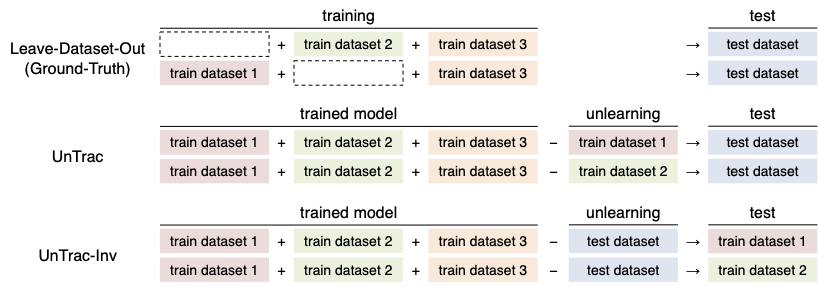

# Code of UnTrac \& UnTrac-Inv

A code for [Unlearning Traces the Influential Training Data of Language Models](https://arxiv.org/abs/2401.15241) @ ACL 2024 (main, long paper)

Authors:   
Masaru Isonuma<sup>1,2</sup> and Ivan Titov<sup>1,3</sup>  
 <sup>1</sup>University of Edinburgh
 <sup>2</sup>University of Tokyo
 <sup>3</sup>University of Amsterdam  



### Environment

Python==3.8

- Run the following command to install the required packages:
```
pip install -r requirements.txt
```

- Or you can reproduce the environment if you use conda:
```
conda env create -n untrac -f untrac.yml
conda activate untrac
```

---

### Reproducing the experiments on the synthetic datasets

- Train T5-XL-lm-adapt on the synthetic dataset A:

```
bash train_synthetic.sh
```

- Run Untrac; Unlearn each training dataset from the trained model and evaluate the unlearned model on the test dataset:

```
bash untrac_synthetic.sh
```

- Run Untrac-Inv; Unlearn the test dataset from the trained model and evaluate the unlearned model on each training dataset:

```
bash untrac-inv_synthetic.sh
```

- Run the following command to reproduce leave-dataset-out:
```
bash loo_synthetic.sh
```

- Refer to `evaluate_synthetic.ipynb` to assess UnTrac and UnTrac-Inv.  

- Replace `synthetic_train00_dataset` & `synthetic_eval00_dataset` with `synthetic_train01_dataset` & `synthetic_eval01_dataset` in the shell scripts if you want to switch to the synthetic dataset B.


---


### Reproducing the experiments on the pretraining datasets

- Preprocess the training datasets and test datasets; then pre-train OPT from scratch:

```
bash pretrain_opt.sh
```

- The downloaded datasets are stored in the `data` directory. Replace `model_name_or_path`, `train_dir`, and `eval_dir` in `untrac_synthetic.sh` with the trained OPT model and the downloaded datasets.
